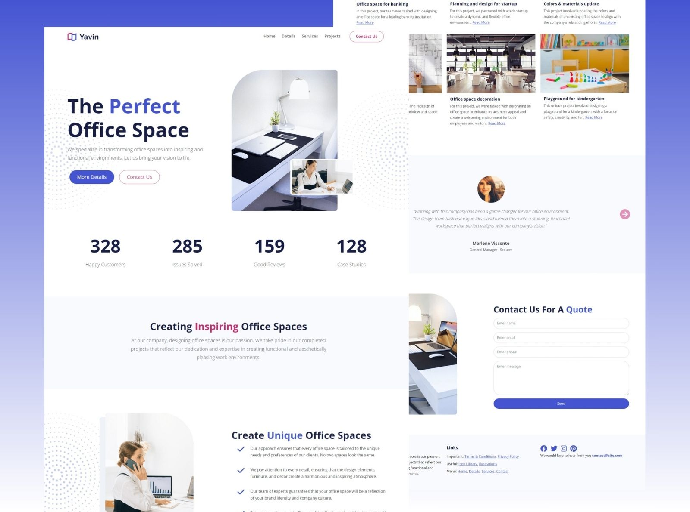

# Yavin Office Design Website
> Bootstrap website for a company that creates and customizes office spaces, made with Bootstrap.
> Live demo [_here_](https://yavin-office-design-website-brown.vercel.app/).


## Table of Contents
* [General Info](#general-information)
* [Technologies Used](#technologies-used)
* [Features](#features)
* [Screenshots](#screenshots)
* [Setup](#setup)
* [Usage](#usage)
* [Project Status](#project-status)
* [Acknowledgements](#acknowledgements)
* [Contact](#contact)


## General Information
Bootstrap website for a company that creates and customizes office spaces. It could be used for just about any kind of business. It is a very light business theme with a clean design.


## Technologies Used
       


## Features
- Clean design with background images/patterns
- Responsive design
- Custom JavaScript for the stat counter
- Nav scroll effect
- Project area
- Testimonial slider/carousel
- Contact form
- Inner article page
- Font awesome icons

## Screenshots



## Setup
This website is built with [Bootstrap](https://getbootstrap.com/) and [Sass](https://sass-lang.com/). It uses [Font Awesome](https://fontawesome.com/) for icons.

In order to customize this website, you need to install [Node.js](https://nodejs.org/en/). Then, clone this repository and run:

```bash
npm install
```


## Usage
This will install Bootstrap, Sass and Font Awesome. To build your CSS files from Sass, run:

```bash
npm run sass:build
```

To watch your Sass files for changes, run:

```bash
npm run sass:watch
```

You can add Bootstrap variables to the `bootstrap.scss` file. You can look at the file `node_modules/bootstrap/dist/scss/_variables.scss` for a list of all the variables. Do NOT edit the `variables.scss` file directly, as it will be overwritten when you update Bootstrap.

To add your own custom styles, use the `styles.scss` file.


## Project Status
Project is: _complete_


## Acknowledgements
This project was worked during "Bootstrap 5 From Scratch | Build 5 Modern Websites" Udemy Course, by Brad Traversy.
- Original Github Repo [Bootstrap 5 Websites](https://github.com/bradtraversy/bootstrap-5-websites).


## Contact
Created by [@Abril Ramirez](https://iscramirezabril.github.io/) - feel free to contact me!
